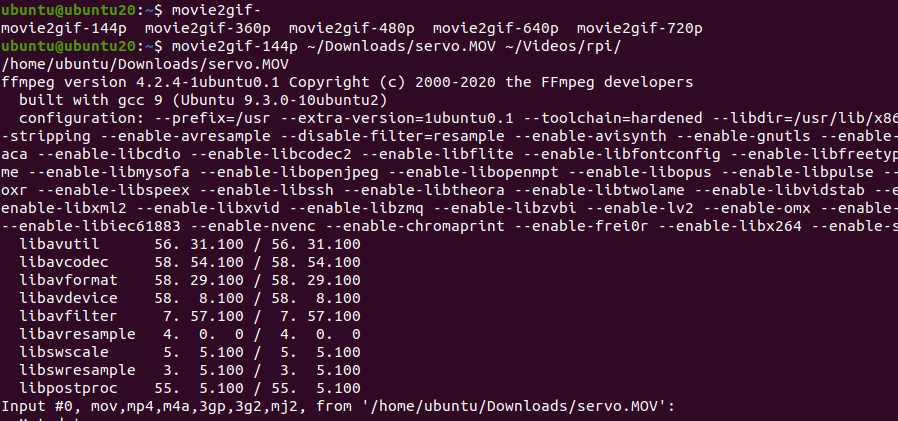

# ffmpeg-preset
ffmpeg preset for Ubuntu

## Install & uninstall

### Install

```bash
$ sudo apt install imagemagic
$ git clone https://github.com/Ar-Ray-code/ffmpeg-preset.git
$ sudo bash ffmpeg-preset/install.bash
```

Install path :  `/usr/local/bin/`

### uninstall

```bash
$ sudo bash ffmpeg-preset/install.bash uninstall
```


## movie2gif

Make the video a gif. The size will be variable for the width and the height will follow the ratio.
The formats supported are mp4 , mp4 , avi , avi , mov , mov , webm , web.

```bash
movie2gif-144p <file or folder 1> <file or folder 2> <file or folder 3> <file or folder 4> <file or folder 5> 

# example
movie2gif-144p ~/Downloads/servo.MOV ~/Videos/rpi/ ~/data.avi
```



## Image to png

I'll implement it soon.